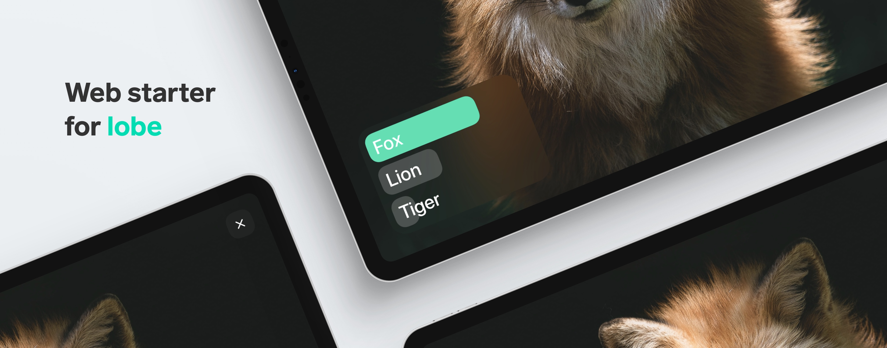

[Lobe](http://lobe.ai/) is a free, easy to use app that has everything you need to bring your machine learning ideas to life.
Web Bootstrap takes the machine learning model created in Lobe, and adds it to a project in the browser that uses
[React](https://reactjs.org), [Create React App](https://github.com/facebook/create-react-app), [TypeScript](https://www.typescriptlang.org/), and [TensorFlow.js](https://www.tensorflow.org/js).

## Get Started

1. Clone or download the project on your computer and install [Yarn](https://yarnpkg.com/). Yarn is the software package that will install all the dependencies and make sure the code automatically reloads when changes are made.

2. Run `yarn install` to install required dependencies and run `yarn start` to start the server in development mode. This will open a web browser to
`localhost:3000`. By default, this project is using the TensorFlow.js exported model from Lobe found in the `public/model/` folder.

3. To use your own model file, open your Lobe project, go to the Use tab, select Export, and click on the TensorFlow.js model file. 
When exported, drag the `model.json`, `signature.json`, and all the `*.bin` files to the `public/model/` folder.

## Additional Information

Check out the [Create React App documentation](https://create-react-app.dev/docs/getting-started)
for more information on React and the project structure.

There are three main components: Camera, Prediction, and StaticImage. 
The Camera, which runs in `components/camera/Camera.tsx` is responsible for displaying a live full screen view of the user's selected webcam. 
The Prediction component `components/prediction/Prediction.tsx` is the box in the lower left hand corner, and is responsible for displaying the top prediction results and their confidences.
The StaticImage component `components/staticImage/StaticImage.tsx` displays an image selected from the file picker and runs it through the model from a canvas element.

### Known Issues
TensorFlow.js on Safari may have problems initializing the WebGL backend for acceleration and will fall back to the CPU.
You can use the WebAssembly (wasm) backend as an alternative to WebGL: 
https://www.tensorflow.org/js/guide/platform_environment#wasm_backend

## Contributing

GitHub Issues are for reporting bugs, discussing features and general feedback on the Web Bootstrap project. Be sure to check our documentation, FAQ and past issues before opening any new ones.

To share your project, get feedback on it, and learn more about Lobe, please visit our community on [Reddit](https://www.reddit.com/r/Lobe/). 
We look forward to seeing the amazing projects that can be built, when machine learning is made accessible to you.
