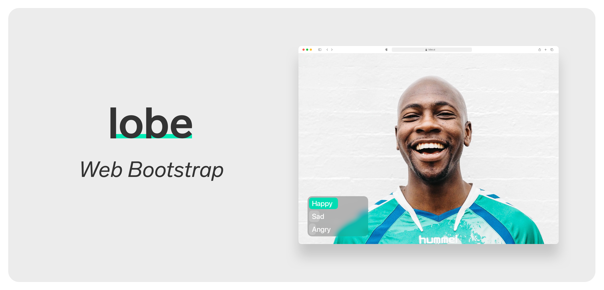
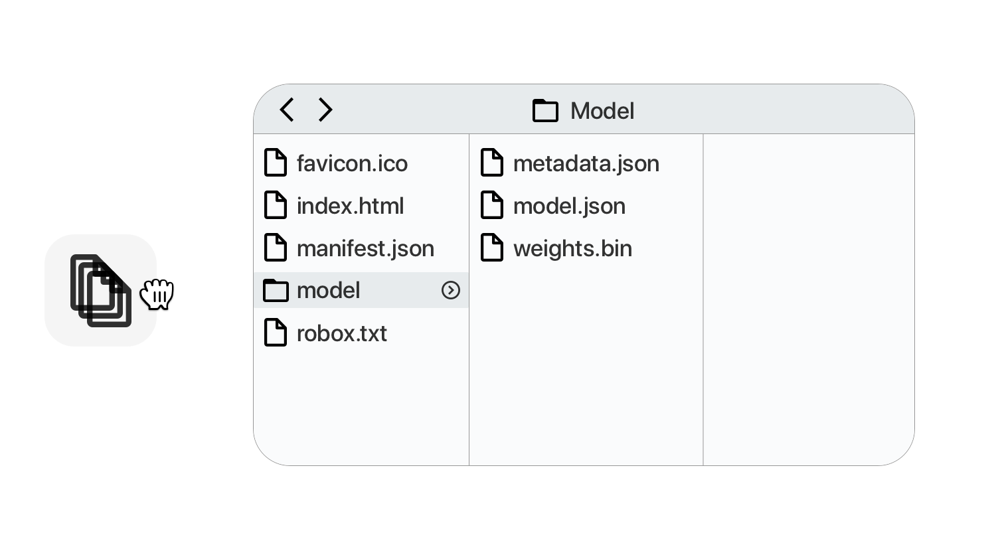

Lobe is an easy to use app that has everything you need to bring your machine learning ideas to life. 
Just show it some examples of what you want it to do, and train a custom machine learning model that can be shipped in your app.

Web Bootstrap takes the machine learning model created in Lobe, and adds it to a project in the browser that uses 
[React](https://reactjs.org),
[Create React App](https://github.com/facebook/create-react-app), 
[TypeScript](https://www.typescriptlang.org/), 
and [TensorFlow.js](https://www.tensorflow.org/js).

## Setup and running the app
`yarn install` to install the package dependencies

`yarn start` will open a browser window with the app running.
Any changes to the code will automatically reload and be reflected in your browser.

Check out the [Create React App documentation](https://create-react-app.dev/docs/getting-started)
for more information.

## Exporting your model

Next, we're going to drop in your new model. So first, let's open your project in Lobe and export it by pressing 
`ctrl/⌘+E` and selecting TensorFlow.js.

Starting your app up again by running `yarn start` will reflect these changes and show you your model live!

## Tips and Tricks

You're more than welcome to use this app as a starting place for your own project. 
There are two main components: the Camera and the Prediction.

### `Camera.js`
The Camera is responsible for displaying a live full screen view of the user's webcam. 
It can easily be modified to take input from any camera attached to your computer, so could hook this up to your sub telescope and use that!

### `Prediction.js`
Our Prediction component is the box in the lower left hand corner. 
It is responsible for displaying the prediction results and their confidences.

### Miscellaneous Pointers
* There's a config file in `/src` that has various config options for the app.
* The prediction happens at a set interval (500ms), while the camera is kept showing a live feed regardless of the prediction frequency.
* The shared css in the `App.css`.
* All the code is commented, this should help you explore and configure to create your own version.

For project ideas or feedback, please visit our community on [Reddit](https://www.reddit.com/r/Lobe/)!

We look forward to seeing the awesome projects you put out there into the world! Cheers!

